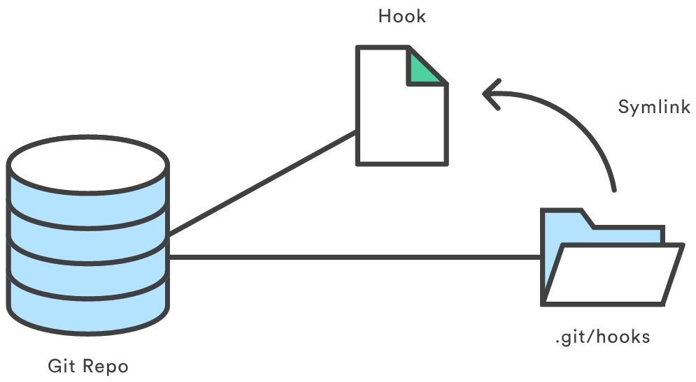
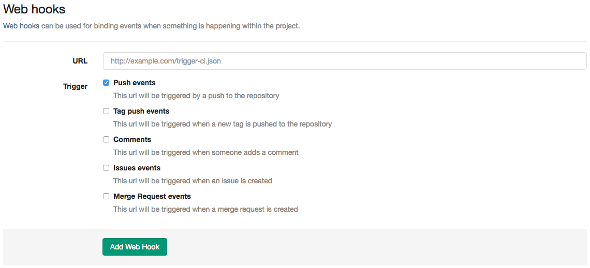

## Git Hooks

Git 能在特定的重要动作发生时触发自定义的脚本。

这些脚本都被存储在 Git 目录下的 hooks 子目录中(`.git/hooks`)。当 git init 初始化一个仓库时，Git 默认会在这个目录中放置一些示例脚本。这些脚本一般都是 shell 脚本。不过自定义的可执行脚本可以使用你喜欢的脚本语言，如 Ruby、[Python](https://www.atlassian.com/git/tutorials/git-hooks) 等。

这些示例的名字都是以 .sample 结尾，如果需要启用它们，首先要移除这个后缀：
```
cd .git/hooks
ls
```
```
applypatch-msg.sample
commit-msg.sample
post-update.sample
pre-applypatch.sample
pre-commit.sample
pre-push.sample
pre-rebase.sample
prepare-commit-msg.sample
update.sample
```
```
cp applypatch-msg.sample applypatch-msg
```

钩子按功能分来两类：客户端和和服务器端的。

客户端钩子由诸如提交(commit)和合并(merge)这样的操作所调用，而服务器端钩子作用于诸如接收被推送(push)的提交这样的联网操作。


## GitLab Web Hooks


顾名思义，Web Hooks 的含义是将本地脚本接口化。GitLab 能在特定的重要动作发生时调用自定义的接口。接口的内部逻辑实现自动化部署或自动化测试的代码。


## 搭建接口服务

以 nginx + supervisor 部署 flask 应用作为我们的接口服务。

### 基于 flask 框架搭建接口服务

创建 python 文件：

```
vi web_hooks_flask.py
```

写入以下代码：

```
#! /usr/bin/env python
# -*- coding: utf-8 -*-

from flask import Flask, request
import json
import os

app = Flask(__name__)

@app.route('/', methods=['POST'])
def index():
    path = '/home/www/test/'  # 项目目录
    return _hooks(path, request.data)

def _hooks(path, data):
    post_data = json.loads(data)
    ref = post_data['ref']
    branch_name = ref.split('/')[-1]
    status = os.system("cd %s && git checkout %s && git pull --rebase" % (path, branch_name,))
    if status == 0:
        return 'success'
    else:
        return 'error'

if __name__ == '__main__':
    app.debug = True
    app.run()
```
保存后，启动服务：
```
python web_hooks_flask.py
```
启动成功：
```
 * Running on http://127.0.0.1:5000/ (Press CTRL+C to quit)
 * Restarting with stat
 * Debugger is active!
 * Debugger pin code: 569-323-263
```

### supervisor 管理进程

supervisor 是一个进程管理程序，能将一个普通的命令行进程变为守护进程，并监控进程状态，异常退出时能自动重启。
在 supervisor 的配置文件中追加：
```
[program:web_hooks_flask]
command=python /path/web_hooks_flask.py  # path 改为具体部署的绝对路径
redirect_stderr=true
stdout_logfile=/path/web_hooks_flask.log  # path 改为具体部署的绝对路径
```
更新配置文件：
```
supervisorctl update
```
启动进程：
```
supervisorctl start web_hooks_flask
```
查看进程：
```
supervisorctl
```
```
web_hooks_flask   RUNNING   pid 29526, uptime 2 days, 20:58:51
```

### nginx 作为反向代理服务器

向 nginx 配置文件中追加配置：
```
server {
        listen       80;
        server_name hooks.test.com;  # 修改为服务器的ip或域名
        location / {
                proxy_pass         http://127.0.0.1:8000/;
                proxy_redirect     off;

                proxy_set_header   Host             $host;
                proxy_set_header   X-Real-IP        $remote_addr;
                proxy_set_header   X-Forwarded-For  $proxy_add_x_forwarded_for;
        }
}
```
重启 nginx 服务。

## 在 GitLab 中配置 web hooks


在上图的URL中，填入`hooks.test.com`保存即可。

## 参考

* Git Hooks 文档可以访问：[Hooks used by Git](https://git-scm.com/docs/githooks) 
* GitLab Web Hooks 文档可以访问：[GitLab Documentation: Webhooks](https://docs.gitlab.com/ee/web_hooks/web_hooks.html)

* nginx 反向代理 文档可以访问：[Module ngx_http_proxy_module](http://nginx.org/en/docs/http/ngx_http_proxy_module.html)

* flask 文档可以访问：[flask docs](http://flask.pocoo.org/docs/)

* supervisor 文档可以访问：[supervisor docs](http://www.supervisord.org/)


